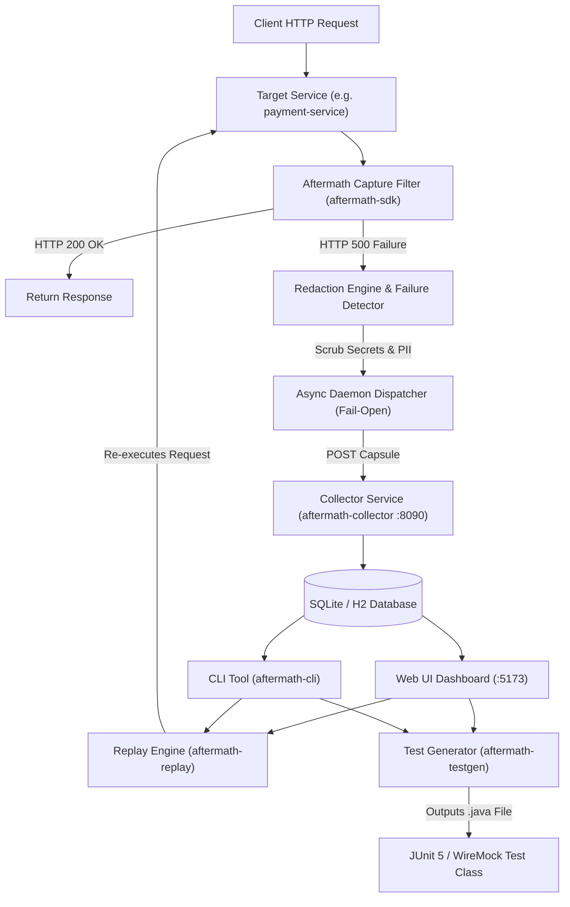

# 💥 AFTERMATH

> **Turn unexpected production failures into zero-touch, reproducible JUnit 5 integration tests.**

[](https://jdk.java.net/21/)
[](https://spring.io/projects/spring-boot)
[](https://react.dev/)
[](https://github.com/Anshuman438/aftermath)
[](LICENSE)

AFTERMATH is an open-source automated incident capture, live replay, and test generation engine for microservices. When an unhandled runtime error occurs in production or staging, AFTERMATH captures the complete request snapshot (headers, body, trace ID, stack trace), automatically redacts sensitive data (tokens, cookies, PII), re-executes the failure live to verify reproduction, and outputs a ready-to-run **JUnit 5 / REST-Assured / WireMock** unit test `.java` file.

---

## ⚡ 1-Click Zero-Touch Auto-Attacher (`aftermath attach`)

Attach AFTERMATH to **any existing Spring Boot microservice** automatically in 1 second with **zero manual code or configuration editing**:

```cmd
# Run inside any Spring Boot project directory:
aftermath attach
```

What `aftermath attach` does automatically:
1. Detects Maven (`pom.xml`) or Gradle (`build.gradle`) safely without XXE vulnerabilities.
2. Injects the `aftermath-sdk` dependency into `pom.xml`.
3. Appends the `aftermath.sdk` configuration block to `application.yml`.

---

## 🏛️ System Architecture



---

## ✨ Key Features

- **⚡ Zero-Touch Auto-Attacher (`aftermath attach`)**: 1-Second CLI project injector that auto-detects and configures Spring Boot applications automatically.
- **⚡ Zero-Overhead Capture SDK (`aftermath-sdk`)**: Spring Boot `@AutoConfiguration` interceptor with `< 1ms` overhead on normal requests and guaranteed **Fail-Open** execution.
- **🔒 Redaction Engine**: Automatically masks `Authorization: Bearer`, cookies, credit cards, emails, passwords, numeric PINs, and sensitive PII before transmission.
- **📡 Central Collector Service (`aftermath-collector`)**: High-performance persistence layer with REST APIs, SHA-256 deduplication, AI root cause analysis, and cascading error chain isolation.
- **🔄 Live Replay Engine (`aftermath-replay`)**: Re-executes captured HTTP snapshots against target microservices with built-in SSRF protection.
- **🧪 Automated Test Generator (`aftermath-testgen`)**: Generates standalone, ready-to-commit **JUnit 5 + WireMock (Standalone Stubs)**, **REST-Assured**, **Spring MockMvc**, or **Spring WebTestClient** test classes.
- **🌐 Polyglot Ecosystem**: Native SDK modules for Java, JavaScript, TypeScript, Python, Go, Rust, C#, PHP, and Ruby.
- **🌐 React Web Dashboard (`aftermath-ui`)**: Interactive React 18 + Vite + Tailwind CSS UI for stack trace inspection, header view, live replay, and one-click test code download.
- **💻 Developer CLI (`aftermath-cli`)**: Terminal command line tool (`aftermath attach`, `status`, `list`, `view`, `replay`, `testgen`, `curl`, `analyze`).

---

## 🚀 Step-by-Step Installation & Setup Guide

### Prerequisites
- **Java JDK 21** (or JDK 17+)
- **Apache Maven 3.8+**
- **Node.js 18+ & npm**
- **Git**

---

### Step 1: Clone Repository & Build Monorepo
```bash
# Clone the repository
git clone https://github.com/Anshuman438/aftermath.git
cd aftermath

# Build all reactor modules
mvn clean package -DskipTests
```

---

### Step 2: Run 1-Click Global CLI Installer

Install `aftermath-cli` directly into your environment `PATH`:

#### **On Windows (PowerShell):**
```powershell
.\install.ps1
```

#### **On Linux / macOS (Bash):**
```bash
chmod +x install.sh
./install.sh
source ~/.bashrc
```

*Verify installation:*
```bash
aftermath status
```

---

### Step 3: Start the AFTERMATH Stack

#### **Option A: 1-Click Script (Windows)**
```powershell
.\start_aftermath_stack.ps1
```

#### **Option B: Manual Startup**
1. **Start Collector (Port 8090):**
   ```bash
   java -jar aftermath-collector/target/aftermath-collector-0.1.0-SNAPSHOT.jar
   ```
2. **Start Web UI Dashboard (Port 5173):**
   ```bash
   cd aftermath-ui && npm install && npm run dev
   ```

*Open Web UI at:* 👉 **`http://localhost:5173`**

---

### Step 4: Auto-Attach & Trigger Test Error

1. Navigate to your Spring Boot project folder and auto-attach:
   ```bash
   aftermath attach
   ```

2. Trigger a sample error on the included `payment-service`:
   ```bash
   # Start payment service
   java -jar sample-app/payment-service/target/payment-service-0.1.0-SNAPSHOT.jar

   # Send failing request triggering NullPointerException
   curl -X POST http://localhost:8082/api/payments/charge \
     -H "Content-Type: application/json" \
     -d '{"amount": 100, "couponCode": "PREMIUM50"}'
   ```

3. Open **`http://localhost:5173`**, inspect the incident, click **"Generate JUnit Test"**, and download your `.java` file!

---

## 💻 CLI Command Reference (`aftermath-cli`)

```cmd
# Auto-attach AFTERMATH SDK to any Spring Boot project
aftermath attach

# Check Collector connectivity status
aftermath status

# List captured incidents in ASCII table format
aftermath list

# Inspect detailed stack trace for an incident
aftermath view <INCIDENT_ID>

# Replay an incident against target service
aftermath replay <INCIDENT_ID> --target http://localhost:8082

# Generate JUnit 5 WireMock test file directly to disk
aftermath testgen <INCIDENT_ID> --out src/test/java

# Export captured request capsule as runnable cURL command
aftermath curl <INCIDENT_ID>

# Run AI Root Cause Analysis & Git Diff suggestion
aftermath analyze <INCIDENT_ID>
```

---

## 📦 Project Structure

```
aftermath/
├── aftermath-sdk/          # Lightweight Spring Boot Interceptor SDK & Redactor
├── aftermath-sdk-node/     # Node.js / Express Error Capture SDK
├── aftermath-sdk-python/   # Python FastAPI / Django Exception SDK
├── aftermath-sdk-go/       # Go Gin / Fiber HTTP Interceptor SDK
├── aftermath-sdk-rust/     # Rust Actix / Axum Library SDK
├── aftermath-sdk-dotnet/   # C# ASP.NET Core Middleware SDK
├── aftermath-sdk-php/      # PHP Laravel / Symfony Middleware SDK
├── aftermath-sdk-ruby/     # Ruby on Rails / Rack Middleware SDK
├── aftermath-collector/    # Central Ingestion, Deduplication, Retention & REST API
├── aftermath-replay/       # Replay Engine with SSRF Protection Shield
├── aftermath-testgen/      # JUnit 5 / WireMock / REST-Assured Test Generator
├── aftermath-cli/          # Picocli Developer CLI
├── aftermath-ui/           # React 18 + Vite + Tailwind CSS Dashboard
├── aftermath-action/       # GitHub Composite CI/CD Action
├── deploy/helm/            # High-Scale Kubernetes Helm Charts
└── sample-app/             # Demo Microservices (coupon-service, payment-service)
```

---

## 📄 License

Distributed under the Apache 2.0 License. See `LICENSE` for details.
