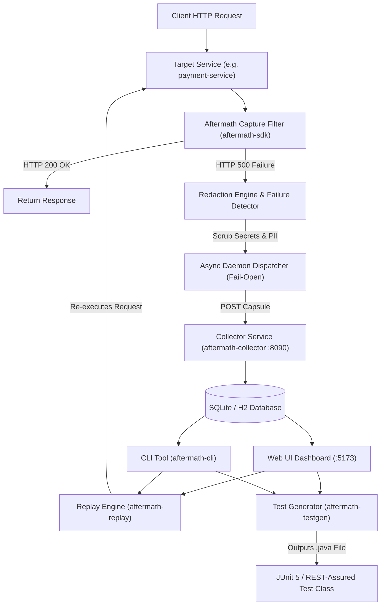

# 💥 AFTERMATH

> **Turn unexpected production failures into zero-touch, reproducible JUnit 5 integration tests.**

[](https://jdk.java.net/21/)
[](https://spring.io/projects/spring-boot)
[](https://react.dev/)
[](LICENSE)

AFTERMATH is an automated incident capture, live replay, and test generation engine for microservices. When an unhandled runtime error occurs in production or staging, AFTERMATH captures the complete request snapshot (headers, body, trace ID, stack trace), automatically redacts sensitive data (tokens, cookies, PII), re-executes the failure live to verify reproduction, and outputs a ready-to-run **JUnit 5 / REST-Assured** unit test `.java` file.

---

## 🏛️ System Architecture



---

## ✨ Key Features

- **⚡ Zero-Overhead Capture SDK (`aftermath-sdk`)**: Spring Boot `@AutoConfiguration` interceptor with `< 1ms` overhead on normal requests and guaranteed **Fail-Open** execution.
- **🔒 Redaction Engine**: Automatically masks `Authorization: Bearer`, cookies, credit cards, emails, passwords, and sensitive PII before transmission.
- **📡 Central Collector Service (`aftermath-collector`)**: High-performance persistence layer with REST APIs for incident retrieval and management.
- **🔄 Live Replay Engine (`aftermath-replay`)**: Re-executes captured HTTP snapshots against target microservices to verify bug reproduction in real time.
- **🧪 Automated Test Generator (`aftermath-testgen`)**: Generates standalone, ready-to-commit **JUnit 5 + REST-Assured**, **Spring MockMvc**, or **Spring WebTestClient** test classes.
- **🌐 React Web Dashboard (`aftermath-ui`)**: Interactive React 18 + Vite + Tailwind CSS UI for stack trace inspection, header view, live replay, and one-click test code download.
- **💻 Developer CLI (`aftermath-cli`)**: Terminal command line tool (`aftermath status`, `list`, `view`, `replay`, `testgen`).

---

## 🚀 1-Minute Quickstart

### Prerequisites
- **JDK 21**
- **Maven 3.8+**
- **Node.js 18+ & npm**

### Step 1: Clone & Start Full Stack
```powershell
git clone https://github.com/Anshuman438/aftermath.git
cd aftermath
powershell -ExecutionPolicy Bypass -File "start_aftermath_stack.ps1"
```

### Step 2: Trigger a Sample Production Bug
In a second terminal window, trigger an intentional `NullPointerException` on the sample `payment-service`:
```powershell
Invoke-RestMethod -Uri "http://localhost:8082/api/payments" -Method Post -Body '{"amount":100, "couponCode":"PREMIUM50", "customerId":"cust-42"}' -ContentType "application/json" -Headers @{ Authorization = "Bearer secret-token-999" }
```

### Step 3: Open Dashboard & Generate Test
1. Open **`http://localhost:5173`** in your browser.
2. Click the incident card to inspect the stack trace and redacted headers (`Authorization: Bearer [REDACTED]`).
3. Click **Replay Incident** to verify reproduction (`reproduced: true`).
4. Click **Generate JUnit Test** and **Download .java**!

---

## 🔌 Integrating SDK into Your Own Microservice

Integrating AFTERMATH into any Spring Boot 3.x application takes **2 minutes**:

### 1. Add Maven Dependency
```xml
<dependency>
    <groupId>dev.aftermath</groupId>
    <artifactId>aftermath-sdk</artifactId>
    <version>0.1.0-SNAPSHOT</version>
</dependency>
```

### 2. Configure `application.yml`
```yaml
aftermath:
  sdk:
    enabled: true
    service-name: my-payment-service
    service-version: 1.0.0
    collector-url: http://localhost:8090/api/v1/incidents
    fail-open: true
```

*Spring Boot `@AutoConfiguration` handles filter injection automatically. Zero custom code required.*

---

## 💻 CLI Commands (`aftermath-cli`)

```cmd
# Check Collector service connectivity status
java -jar aftermath-cli/target/aftermath-cli-0.1.0-SNAPSHOT.jar status

# List captured incidents in ASCII table format
java -jar aftermath-cli/target/aftermath-cli-0.1.0-SNAPSHOT.jar list

# Inspect detailed stack trace for an incident
java -jar aftermath-cli/target/aftermath-cli-0.1.0-SNAPSHOT.jar view <INCIDENT_ID>

# Replay an incident against target service
java -jar aftermath-cli/target/aftermath-cli-0.1.0-SNAPSHOT.jar replay <INCIDENT_ID> --target http://localhost:8082

# Generate JUnit 5 test file directly to disk
java -jar aftermath-cli/target/aftermath-cli-0.1.0-SNAPSHOT.jar testgen <INCIDENT_ID> --out src/test/java
```

---

## 📡 REST API Reference

| Endpoint | Method | Description |
| :--- | :--- | :--- |
| `/api/v1/incidents` | `POST` | Ingests new incident event capsule |
| `/api/v1/incidents` | `GET` | Paginated list of incidents (`?page=0&size=20&search=`) |
| `/api/v1/incidents/{id}` | `GET` | Fetches single incident capsule details |
| `/api/v1/incidents/{id}/replay` | `POST` | Re-executes request against target service URL |
| `/api/v1/incidents/{id}/generate-test` | `POST` | Generates runnable JUnit 5 `.java` test artifact |

---

## 📦 Project Structure

```
aftermath/
├── aftermath-sdk/          # Lightweight Spring Boot Interceptor SDK & Redactor
├── aftermath-collector/    # Central Ingestion & Database Persistence Service
├── aftermath-replay/       # Replay Engine using Java 11 HttpClient
├── aftermath-testgen/      # JUnit 5 / REST-Assured Test Generator Engine
├── aftermath-cli/          # Picocli Developer Command-Line Interface
├── aftermath-ui/           # React 18 + Vite + Tailwind CSS Dashboard
├── sample-app/             # Demo Microservices (coupon-service, payment-service)
└── start_aftermath_stack.ps1 # 1-Click System Orchestrator Script
```

---

## 📄 License

Distributed under the Apache 2.0 License. See `LICENSE` for details.
